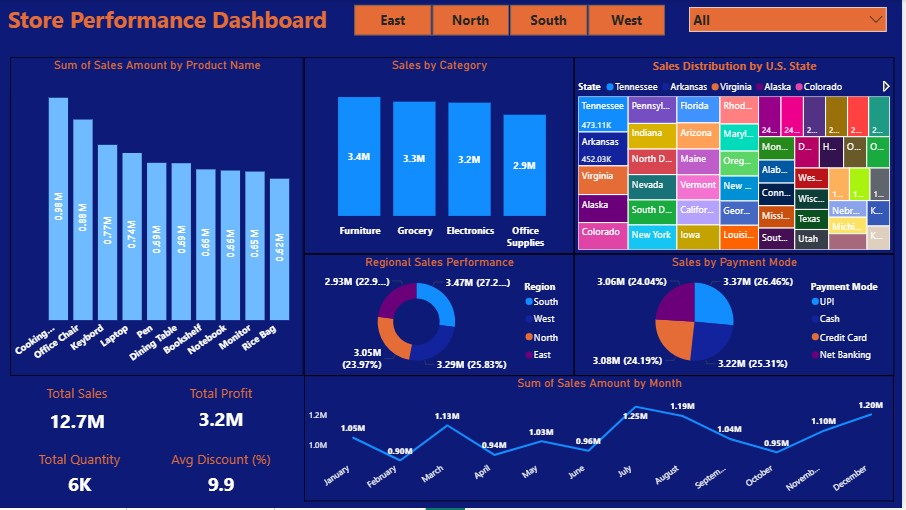
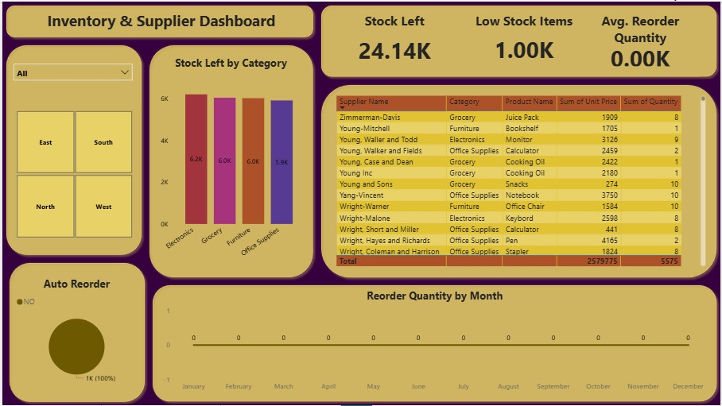
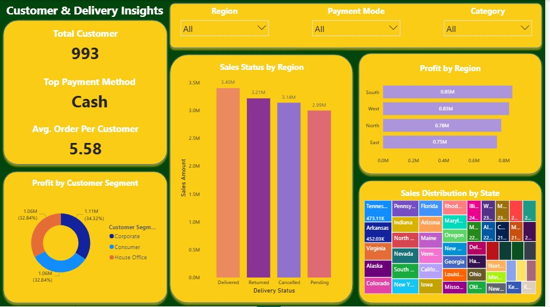

# 📊 Retail Sales & Customer Insights Dashboard

## 🚀 Project Overview
This project demonstrates an end-to-end data analysis workflow using Python and Power BI.

- Data generated using Python (Faker)
- Exploratory Data Analysis (EDA) performed using Pandas, NumPy, and Seaborn
- Interactive dashboards created in Power BI

---

## 🛠️ Tools & Technologies
- Python (Pandas, NumPy, Seaborn)
- Power BI
- Excel

---

## 📈 Key Insights
- Identified top-performing regions and states
- Analyzed customer segment profitability
- Discovered most preferred payment methods
- Evaluated sales trends over time

---

## 📊 Dashboard Previews

### Store Performance Dashboard

### Inventory & Supplier Dashboard

### Customer & Delivery Dashboard

---

## 📁 Files Included
- Python notebooks for data generation & analysis
- Dataset (Excel)
- Power BI dashboard file (.pbix)
- Dashboard screenshots

---

## 💡 Business Value
This dashboard helps businesses:
- Track sales performance
- Understand customer behavior
- Optimize decision-making using data insights
- Track sales performance
- Understand customer behavior
- Optimize decision-making using data insights
